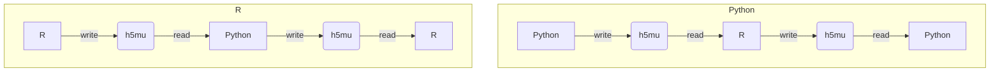

# ms-scverse-bioconductor

[![Tests][badge-tests]][tests]
[![Documentation][badge-docs]][documentation]

[badge-tests]: https://img.shields.io/github/actions/workflow/status/lucas-diedrich/ms-scverse-bioconductor/test.yaml?branch=main
[badge-docs]: https://github.com/lucas-diedrich/ms-scverse-bioconductor/actions/workflows/docs.yaml/badge.svg

Joint MS-proteomics analysis of Python and R packages

> [!NOTE]
> Work in progress


This repository documents approaches on how to integrate R and Python analyses

## For users
This GitHub repository contains tutorials on how to perform cross-ecosystem MS-proteomics data analyses in Python and R, specifically with alphapepttools/mulink (in Python) and scp/QFeatures (in R). Please refer to the [documentation][], in particular, the [tutorials][].

## For developers

### Installation

We provide some utility functions to generate test data for developers. You can install this repository as a regular python package with command line utilities.

```
conda create -n msproteomics python=3.13 -y
pip install git+https://github.com/lucas-diedrich/ms-scverse-bioconductor.git
```

### Usage
Use the command line utilities to generate test data etc.

```bash
ms-scverse-bioconductor --help
```

### Docker
If you do not want to install a python environment, you can also use the docker image that mirrors the CLI interface:

```bash
docker run --rm -it ldiedrich/ms-scverse-bioconductor --help
```

Export example data:
```bash
# Mount the current directory onto /data in the docker container and export the data to the local directory
docker run --rm -it -v $(pwd):/data ldiedrich/ms-scverse-bioconductor export --n-mod 3 --output-dir ./data --name mudata
```

### Round-trip integration tests

`R/io.R` converts between `.h5mu` files and `QFeatures` objects. The suite in
`tests/integration` drives both directions of a full round trip and checks what
survives it:



The two stacks run as separate processes and exchange `.h5mu` files only.
Each trip is compared in the language it started in.

Every case declares which deviations it tolerates, and the assertion is an equality: an unexpected deviation is a regression, and a tolerated one that stopped appearing means a known loss has been fixed and the profile needs updating.

The whole R side is one CLI, usable by hand:

```bash
Rscript R/roundtrip-cli.R check                                  # versions, and whether both stacks are present
Rscript R/roundtrip-cli.R list-fixtures
Rscript R/roundtrip-cli.R fixture    --name feat3 --out r0.h5mu  # QFeatures fixture -> .h5mu
Rscript R/roundtrip-cli.R read-write --in a.h5mu  --out b.h5mu   # .h5mu -> QFeatures -> .h5mu
Rscript R/roundtrip-cli.R compare    --fixture feat3 --in r1.h5mu
Rscript R/roundtrip-cli.R selftest
```

#### Running the suite

In the container, which carries both stacks:

```bash
docker build -f docker/Dockerfile.integration -t ms-scverse-bioconductor:integration .
docker run --rm ms-scverse-bioconductor:integration
```

Or against a local R installation. `MSSB_RSCRIPT` selects the interpreter; with
none available the integration tests skip, so the unit suite still runs on a machine without R.

```bash
MSSB_RSCRIPT=~/mamba/envs/qfeatures/bin/Rscript pytest tests
```

The R leg needs `QFeatures`, `MuData`, `MultiAssayExperiment`, `rhdf5`, `Matrix`
and `jsonlite`; `roundtrip-cli.R check` reports which of them are missing.

## Release notes

See the [changelog][].

## Contact

For questions and help requests, you can reach out in the [scverse discourse][].
If you found a bug, please use the [issue tracker][].


[uv]: https://github.com/astral-sh/uv
[scverse discourse]: https://discourse.scverse.org/
[issue tracker]: https://github.com/lucas-diedrich/ms-scverse-bioconductor/issues
[tests]: https://github.com/lucas-diedrich/ms-scverse-bioconductor/actions/workflows/test.yaml
[documentation]: https://github.io/lucas-diedrich/ms-scverse-bioconductor
[changelog]: https://github.com/lucas-diedrich/ms-scverse-bioconductor/releases
[api documentation]: https://ms-scverse-bioconductor.readthedocs.io/page/api.html
[tutorials]: https://ms-scverse-bioconductor.readthedocs.io/page/tutorials.html

[venv]: https://docs.python.org/3/tutorial/venv.html
