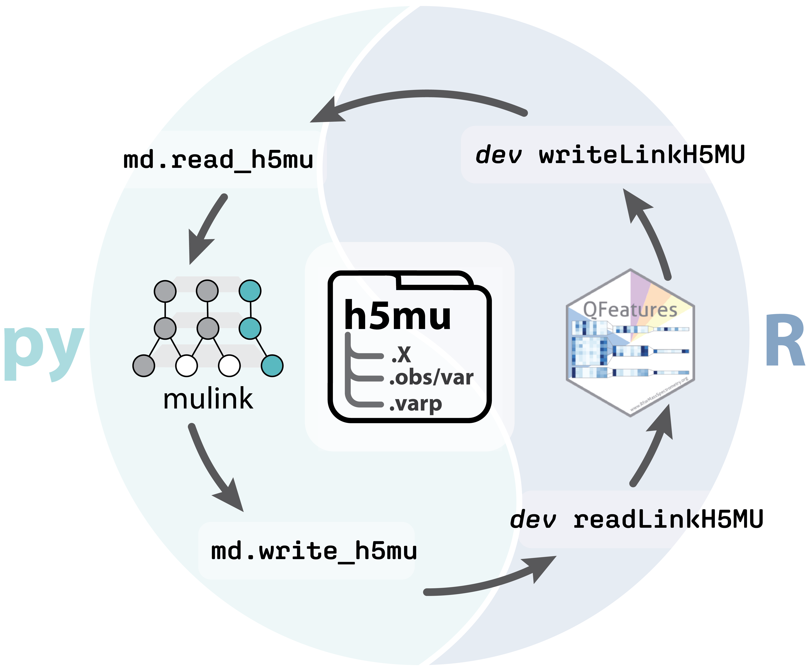

# Interconversion between MS-centric Bioconductor and Python Data Structures

The [Bioconductor](https://www.bioconductor.org) and [scverse](https://scverse.org) ecosystems in R and Python respectively provide foundational tools for high-throughput omics in general, and single-cell omics in particular. Single-cell proteomics data analysis faces distinctive challenges: mass spectrometry data have statistical properties and missingness patterns unlike other single-cell modalities, organized hierarchically across precursors, peptides, proteins, and protein groups.

Lead developers of MS proteomics-specific data structures and tools in the two projects convened at a [scverse proteomics hackathon](https://github.com/scverse/2026_03_hackathon_proteomics.git) in March 2026 and have since worked together to harmonize their respective data structures, QFeatures and mudata/mulink, for storing and manipulating quantitative proteomics data across this feature hierarchy while preserving data provenance along the full analysis pipeline. This work enables full round trips between languages also connects the higher-level analysis tools built on each structure (scp, [alphapepttools](https://github.com/MannLabs/alphapepttools)).



Here we present this collaborative work and show how it facilitates single-cell proteomics analysis across ecosystems, spanning key steps such as missing-value imputation, differential expression analysis, and advanced single-cell analyses like trajectory inference. By enabling principled, language-agnostic processing of SCP data, this effort aims to lay a foundation for field-wide best practices and standards for single-cell proteomics analysis.


```{toctree}
:hidden: true
:maxdepth: 1

tutorials.md
changelog.md
contributing.md
references.md
```


## References

> Danila Bredikhin, Ilia Kats, and Oliver Stegle. MUON: multimodal omics analysis framework. Genome Biol, 23(1):42, February 2022. PMID:35105358, doi:10.1186/s13059-021-02577-8.

> Brennsteiner, V., Ben-Moshe, S., Diedrich, L., Mann, M., & Schwörer, M. alphapepttools [Computer software]. https://github.com/MannLabs/alphapepttools

> Gatto L, Vanderaa C (2026). QFeatures: Quantitative features for mass spectrometry data. doi:10.18129/B9.bioc.QFeatures. R package version 1.22.0, https://bioconductor.org/packages/QFeatures.
